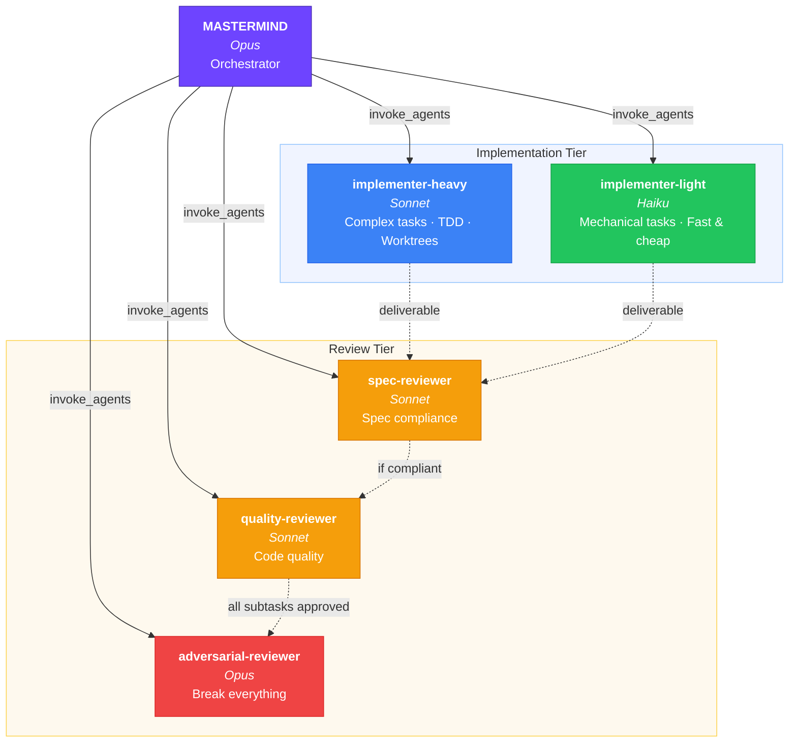
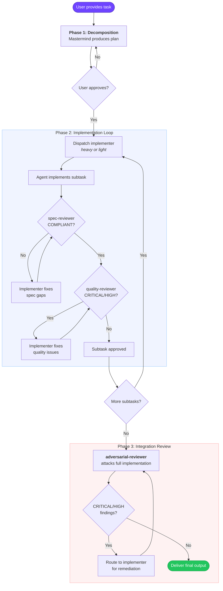

# Mastermind Agent Constellation

Multi-agent orchestration system for Code Puppy. The Mastermind decomposes tasks, dispatches specialized sub-agents, and drives iterative review until quality gates pass.

## Architecture



## Workflow



## Agents

| Agent | Model | Role |
|---|---|---|
| `mastermind` | Opus | Decomposes tasks, dispatches agents, reviews, synthesizes |
| `implementer-heavy` | Sonnet | Complex implementation: multi-file, architecture, TDD |
| `implementer-light` | Haiku | Mechanical tasks: config, boilerplate, simple edits |
| `spec-reviewer` | Sonnet | Binary spec compliance: COMPLIANT / NON_COMPLIANT |
| `quality-reviewer` | Sonnet | Code quality with severity-ranked findings |
| `adversarial-reviewer` | Opus | Tries to break everything. The paranoid one. |

## Setup

### 1. Copy agents into place

```bash
cp agents/*.json ~/.code_puppy/agents/
```

### 2. Pin models

In Code Puppy, use `/pin_model` to assign each agent its model:

```
/pin_model mastermind           → claude-opus-4-6
/pin_model implementer-heavy    → claude-sonnet-4-6
/pin_model implementer-light    → claude-haiku-4-5
/pin_model spec-reviewer        → claude-sonnet-4-6
/pin_model quality-reviewer     → claude-sonnet-4-6
/pin_model adversarial-reviewer → claude-opus-4-6
```

### 3. Switch to mastermind

```
/agent mastermind
```

### 4. Activate skills

The agents reference these skills — install them if you haven't:

```bash
# obra/superpowers (TDD, worktrees, SDD, finishing branches)
# Install via your preferred method — plugin marketplace or manual

# NeoLabHQ/context-engineering-kit (DDD, SADD)
/plugin install ddd@NeoLabHQ/context-engineering-kit
/plugin install sadd@NeoLabHQ/context-engineering-kit
```

## Workflow

**Phase 1 — Decomposition**: Mastermind analyzes your task, produces an implementation plan with subtasks, agent assignments, dependencies, and execution order. Presents for approval.

**Phase 2 — Implementation**: For each subtask, Mastermind dispatches the assigned implementer, then runs spec-reviewer → quality-reviewer in sequence. Revisions loop up to 3 times before escalating.

**Phase 3 — Integration Review**: After all subtasks pass, adversarial-reviewer attacks the full implementation. CRITICAL/HIGH findings trigger targeted fixes and re-review.

## Agent Selection Heuristic

The Mastermind picks agents based on subtask characteristics:

**implementer-heavy** (Sonnet) when:
- Multi-file changes
- New modules, classes, or architectural components
- Algorithmic complexity or nuanced logic
- Integration work across subsystems
- Decisions requiring judgment

**implementer-light** (Haiku) when:
- Single-file edits with clear instructions
- Config/env changes
- Boilerplate generation
- Renaming/moving
- Documentation updates
- Mechanical refactors (pattern already established)

## Cost Optimization Notes

- Haiku is ~60x cheaper than Opus per token. Route aggressively to `implementer-light` for mechanical work.
- Spec-reviewer and quality-reviewer on Sonnet are a deliberate tradeoff: they need enough capability to catch real issues but run on every subtask, so cost matters.
- Adversarial-reviewer on Opus is justified: it runs once at integration time and needs deep reasoning to find subtle bugs.
- If revision loops are firing frequently on Haiku tasks, the subtask scoping is probably too loose. Tighten the spec rather than upgrading the model.
