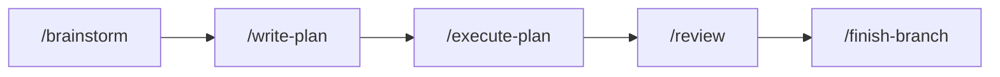
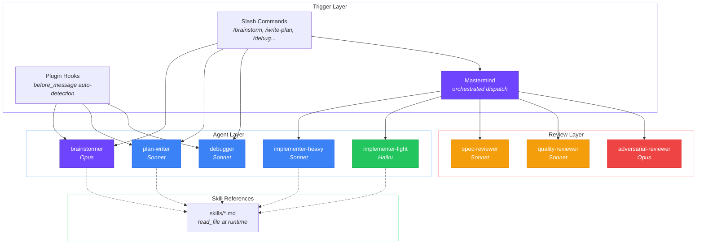
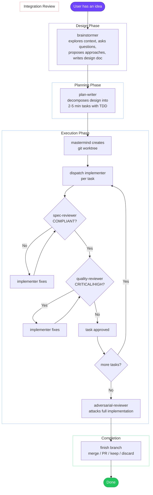

# code-puppy-superpowers

A port of [obra/superpowers](https://github.com/obra/superpowers) for [Code Puppy](https://github.com/mpfaffenberger/code_puppy). The same structured software development workflow — brainstorm, plan, execute with sub-agents, review, finish — adapted to Code Puppy's JSON agents, `invoke_agent` tool, custom commands, and plugin callback system.

## How It Works

Superpowers is a development methodology: brainstorm a design before coding, break it into a plan, execute with fresh sub-agents per task, review everything twice (spec compliance then code quality), and finish the branch cleanly. This repo packages that methodology for Code Puppy.



Each step maps to a dedicated Code Puppy agent that can be triggered three ways: slash commands for direct access, automatic detection via plugin hooks, or orchestrated dispatch via the mastermind agent.

## Architecture



## Full Workflow



## Installation

```bash
git clone https://github.com/citizen-123/code-puppy-agents.git
cd code-puppy-agents
python install.py
```

The install script copies agents, commands, skills, and the plugin into your Code Puppy environment.

### Pin Models

After installing, assign models to each agent:

```
/pin_model mastermind           → claude-opus-4-6
/pin_model brainstormer         → claude-opus-4-6
/pin_model plan-writer          → claude-sonnet-4-6
/pin_model debugger             → claude-sonnet-4-6
/pin_model implementer-heavy    → claude-sonnet-4-6
/pin_model implementer-light    → claude-haiku-4-5
/pin_model spec-reviewer        → claude-sonnet-4-6
/pin_model quality-reviewer     → claude-sonnet-4-6
/pin_model adversarial-reviewer → claude-opus-4-6
```

## Usage

### Slash Commands

| Command | What It Does |
|---|---|
| `/brainstorm` | Start collaborative design — explore, question, propose, validate |
| `/write-plan` | Turn an approved design into an implementation plan |
| `/execute-plan` | Execute a plan with sub-agents and two-stage review |
| `/debug` | Systematic hypothesis-driven debugging |
| `/review` | Run spec + quality + adversarial review on current code |
| `/finish-branch` | Complete the branch — merge, PR, keep, or discard |

### Agent Switching

```
/agent brainstormer          # Design mode
/agent plan-writer           # Planning mode
/agent mastermind            # Full orchestration
/agent debugger              # Debugging mode
```

### Automatic Detection (Plugin)

The plugin's `before_message` hook detects intent patterns and suggests the appropriate agent:

| You Say | Agent Triggered |
|---|---|
| "Let's build a..." | brainstormer |
| "This is broken..." | debugger |
| "Write a plan for..." | plan-writer |

## Agents

| Agent | Model | Role |
|---|---|---|
| `mastermind` | Opus | Orchestrates the full workflow — worktree, dispatch, review loops |
| `brainstormer` | Opus | Collaborative design refinement through structured dialogue |
| `plan-writer` | Sonnet | Converts designs into granular, executable implementation plans |
| `debugger` | Sonnet | Systematic hypothesis-driven debugging |
| `implementer-heavy` | Sonnet | Complex implementation — multi-file, architecture, TDD |
| `implementer-light` | Haiku | Mechanical tasks — config, boilerplate, simple edits |
| `spec-reviewer` | Sonnet | Binary spec compliance: COMPLIANT / NON_COMPLIANT |
| `quality-reviewer` | Sonnet | Code quality with severity-ranked findings |
| `adversarial-reviewer` | Opus | Tries to break everything |

## Skills (Runtime References)

Agents read these via `read_file` when they need the full methodology:

| Skill | Purpose |
|---|---|
| `brainstorming` | Design exploration process |
| `writing-plans` | Plan decomposition methodology |
| `test-driven-development` | RED-GREEN-REFACTOR discipline |
| `using-git-worktrees` | Isolated workspace setup |
| `finishing-a-development-branch` | Branch completion workflow |
| `subagent-driven-development` | The core execution pattern |
| `systematic-debugging` | Hypothesis-driven debugging |
| `requesting-code-review` | Two-stage review structure |
| `receiving-code-review` | How to handle review feedback |
| `dispatching-parallel-agents` | Parallel execution rules |

## Project Structure

```
code-puppy-agents/
├── install.py                # Install script
├── plugin/                   # Code Puppy plugin (callbacks)
│   ├── __init__.py          #   on_startup + before_message hooks
│   └── config.py            #   trigger patterns and skill registry
├── agents/                   # JSON agents → ~/.code_puppy/agents/
│   ├── mastermind.json      #   orchestrator (Opus)
│   ├── brainstormer.json    #   design refinement (Opus)
│   ├── plan-writer.json     #   plan creation (Sonnet)
│   ├── debugger.json        #   systematic debugging (Sonnet)
│   ├── implementer-heavy.json  # complex tasks (Sonnet)
│   ├── implementer-light.json  # mechanical tasks (Haiku)
│   ├── spec-reviewer.json      # spec compliance (Sonnet)
│   ├── quality-reviewer.json   # code quality (Sonnet)
│   └── adversarial-reviewer.json # break everything (Opus)
├── commands/                 # Slash commands → .claude/commands/
│   ├── brainstorm.md
│   ├── write-plan.md
│   ├── execute-plan.md
│   ├── debug.md
│   ├── review.md
│   └── finish-branch.md
└── skills/                   # Reference docs → ~/.code_puppy/superpowers/skills/
    ├── brainstorming/
    ├── writing-plans/
    ├── test-driven-development/
    ├── using-git-worktrees/
    ├── finishing-a-development-branch/
    ├── subagent-driven-development/
    ├── systematic-debugging/
    ├── requesting-code-review/
    ├── receiving-code-review/
    └── dispatching-parallel-agents/
```

## Superpowers → Code Puppy Translation

| Superpowers Mechanism | Code Puppy Equivalent |
|---|---|
| SKILL.md auto-discovery | `on_startup` callback registers skills |
| `/superpowers:brainstorm` | `/brainstorm` command (markdown) |
| Session start hook | `on_startup` callback |
| Context-based skill triggers | `before_message` callback pattern matching |
| Subagent dispatch via `Task` tool | `invoke_agent` tool |
| SKILL.md progressive loading | `read_file` by agents at runtime |
| Plugin marketplace install | `python install.py` |

## Golden Rules

All agents enforce these principles:

- **DRY** — Single source of truth for every piece of logic
- **KISS** — Simple over clever, readable over compact
- **YAGNI** — Build what's needed now, not what might be needed later
- **SOLID** — Single responsibility, open/closed, Liskov substitution, interface segregation, dependency inversion

## Credits

Based on [obra/superpowers](https://github.com/obra/superpowers) by Jesse Vincent. Adapted for [Code Puppy](https://github.com/mpfaffenberger/code_puppy).
